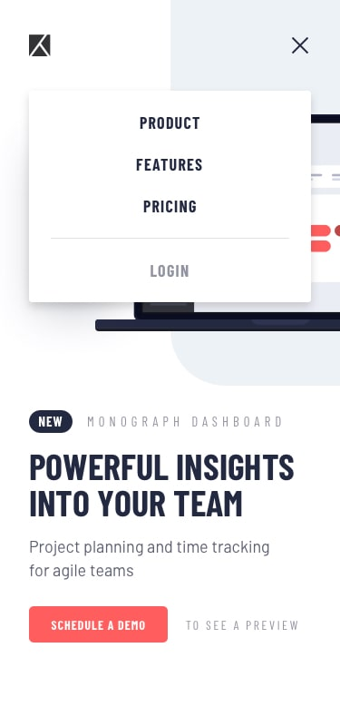

# fm-project-tracking (Project Tracking Component)

## Live

Live Preview: [https://nitearie.github.io/fm-project-tracking/](https://nitearie.github.io/fm-project-tracking/)

## Design 

> Desktop

> Desktop Active State

> Mobile

> Mobile Navigation

## General

My challenge is to build out this intro component and get it looking as close to the design as possible.

My users should be able to:

- View the optimal layout for the site depending on their device's screen size
- See hover states for all interactive elements on the page
- Create the background shape using code
